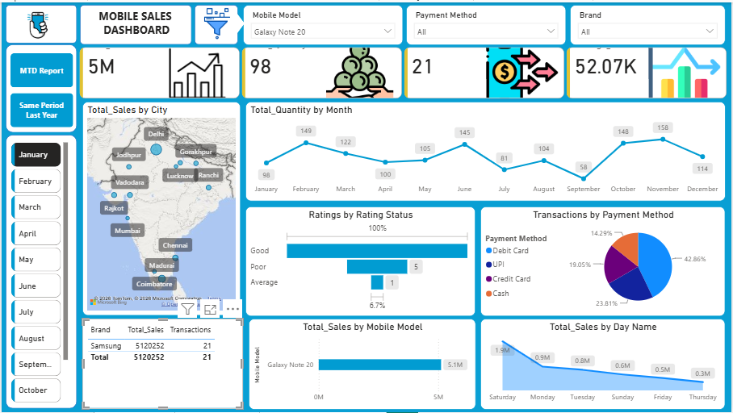

# 📱 Mobile Sales Dashboard — Power BI

An interactive **Mobile Sales Dashboard** built using **Microsoft Power BI** to analyze sales performance, customer behavior, product performance, payment methods, and key business KPIs.

## 📊 Project Overview

This project transforms mobile sales data into an interactive dashboard that provides a clear overview of business performance and helps identify important sales trends and patterns.

The dashboard allows users to analyze:

* Overall sales and quantity performance
* Monthly sales trends
* Sales by mobile brand and model
* Sales performance across cities
* Customer ratings
* Payment method distribution
* Average selling price
* Month-to-date and year-over-year performance

## 🛠️ Tools & Technologies

* **Power BI** — Dashboard development and data visualization
* **DAX** — Measures and time-intelligence calculations
* **Power Query** — Data cleaning and transformation
* **Microsoft Excel** — Source data
* **Data Modeling** — Calendar table and relationships

## 📌 Dashboard Features

### Key Performance Indicators

The dashboard includes important KPIs such as:

* **Total Sales**
* **Total Quantity Sold**
* **Number of Transactions**
* **Average Price**

### Sales Analysis

* Monthly sales trends
* Sales by mobile brand
* Sales by mobile model
* City-wise sales analysis
* Payment method analysis
* Customer rating distribution

### Interactive Analysis

Users can dynamically filter the dashboard using slicers for:

* Month
* Mobile Brand
* Mobile Model
* Payment Method

### Time Intelligence

DAX measures were used to perform time-based analysis, including:

* **MTD — Month-to-Date**
* **Same Period Last Year**

## 🧮 Key DAX Measures

Examples of the main measures used in the project:

```DAX
Total_Quantity =
SUM(Sales_Data[Units Sold])
```

```DAX
Total_Sales =
SUMX(
    Sales_Data,
    Sales_Data[Units Sold] * Sales_Data[Price Per Unit]
)
```

```DAX
Transactions =
COUNTROWS(Sales_Data)
```

```DAX
Average_Price =
AVERAGE(Sales_Data[Price Per Unit])
```

```DAX
MTD =
TOTALMTD(
    [Total_Sales],
    Custom_Calendar[Date]
)
```

```DAX
Same Period Last Year =
CALCULATE(
    [Total_Sales],
    SAMEPERIODLASTYEAR(Custom_Calendar[Date])
)
```

## 📷 Dashboard Preview



## 📂 Repository Structure

```text
Mobile-Sales-Dashboard/
│
├── README.md
│
├── power-bi/
│   └── Mobile_Sales_Dashboard.pbix
│
├── data/
│   └── Mobile Sales Data.xlsx
│
├── images/
│   └── dashboard-preview.png
│
├── dax/
│   └── Measures.md
│
└── assets/
    └── embedded/
```

## 🚀 How to Use

1. Download or clone this repository.
2. Open `Mobile_Sales_Dashboard.pbix` using **Power BI Desktop**.
3. Use the available slicers to filter the dashboard.
4. Interact with the visualizations to explore sales trends and business insights.

## 🎯 Skills Demonstrated

* Data cleaning and transformation
* Power Query
* Data modeling
* DAX
* Time-intelligence calculations
* KPI development
* Interactive dashboard design
* Business data analysis
* Data visualization
* Analytical storytelling

## 👤 Author

**Rohan Tomar**

**Data Analyst | SQL | Power BI | Excel | Python**
